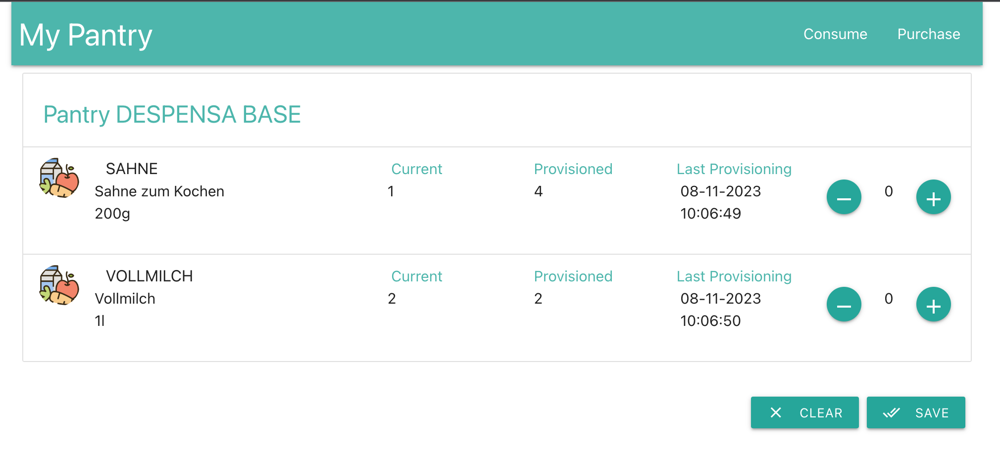

# my-pantry

It manages pantry inventories and creates shopping lists.

Still under development.

### pantry-service (localhost:8080) :

- Manages pantry, pantry items and products.
- Manages the consumption of the items in the pantry as well as their replenishment
- Produces an event and sends it to Kafka Topic (PurchaseCreateTopic) when a PantryItem reaches the defined threshold
- Listens to Kafka Topic (PurchaseCompleteTopic) and updates the pantry once the Purchase Order is closed
- Stores data in Postgres

| Request Type |  Path                    | Description          |
|:-------------|:-------------------------|:---------------------|
|GET/POST|/pantries|Pantry List & Create|
|GET/PUT/DELETE|/pantries/{pantryId}|Pantry CRUD|
|GET/POST|/pantries/{pantryId}/items|Pantry Items List & Create|
|GET/PUT/DELETE|/pantries/{pantryId}/items/{productId}| Pantry Items CRUD|
|POST|/pantries/{pantryId}/consume| Consume/Use an Item from a Pantry|

### purchase-service (localhost:8081) :

- Creates a shopping list to be purchases
- Listens to Kafka Topic (PurchaseCreateTopic) to manage a list of items to be purchased
- Produces an event and sends it to Kafka Topic (PurchaseCompleteTopic) once the purchase is closed
- Stores data in Postgres

| Request Type | Path                     | Description          |
|:-------------|:-------------------------|:---------------------|
| GET| /purchases | List Purchase Orders|
| POST| /purchases | Create an open Purchase Order|
| GET| /purchases/open | Get an existing open Purchase Order |
| POST| /purchases/close  | Close and complete a Purchase Order|
| GET| /purchases/items | List of items to be purchased, not yet associated to an open order|

### pantry-web (localhost:3000) :

- Development is still in initial stages, while I learn `Reactjs`.
- Home Page and Consume Page available.

/Components/Home.js - Pantry List:

/Components/Consume.js
  
