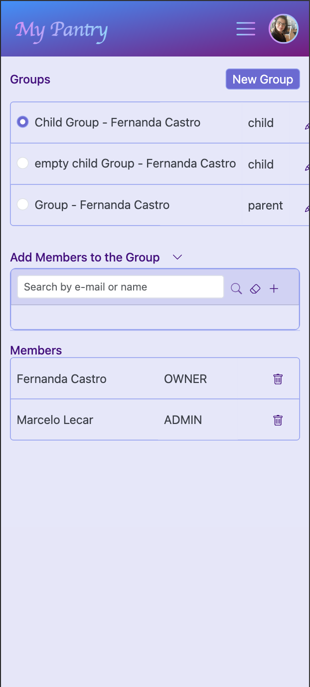

# My Pantry

version: 0.0.4 <br />

- Access Control is now centralized in account_service, as part of the authorization.
  - Why? So far, Pantry and Product are the only relevant entities when it comes to access control. So instead of making
    purchase-service request access-control data to pantry-service, I decided to centralize it together with
    authorization logic in account-service.
- New Permission: PURCHASE_PANTRY Permissions refactored: CONSUME_PANTRY, ANALYSE_PANTRY
- Control the access to Purchases
- Purchase by selecting specific pantries or all

Plans for next versions:

- CRUD for Role and Permissions
- Wizards that create basic products and pantry with basic items
- CRUD for Supermarkets and its particular order of categories

My Pantry manages pantries and automatically creates shopping lists as products are consumed from the
inventory. <br/> <br/>
You can also share your Pantries, Shopping Lists and Products with other users, by adding users to your Account Group.

The frontend is developed in Reactjs and Javascript, while backend is written in Java 17, Spring Boot and Spring
Security. The Authentication is possible by either Google Sign-in (Google IDToken - having localhost as callback) or
user/password.

<b>Run it from Docker</b> by getting docker-compose.yml file from the project root folder: <br/>
(It will pull images from my public DockerHub repository)
```docker compose up -d```

Screenshots: <br />





### pantry-web (localhost:3000) :

| Path | Description|
|:-------------|:-------------------------|
|/pantries<br/> | List Pantries and its related actions: new, edit and delete |
|/consume<br/>  | <b><u>After selecting a pantry</u></b>, you can consume items from it. <br /> Once the consumption of an item reaches 50%, an event to purchase more of that item is fired.
|/purchase<br/> | Lists items to be purchased. <br/> Items can be sorted by your favorite Supermarket category order. <br/> A shopping list is created <b>once you open a new Order</b>. <br/> When you're done with shopping and <b>close the Order</b>, then it updates your Pantry Inventory with the purchased items.
|/product<br/> | List Products and its related actions: new, edit and delete

### account-service (localhost:8082) :

- Manages Accounts, Account Groups and Account Group Members
- Manages Roles and Permissions
- Acts as **_Authentication server_**:
  - validating the _Google IDToken_ or the user/password informed
  - issuing an _JWT Token_ embedded in a _Http Only Cookie_
- Acts as **_Authorization server_**:
  - retrieving the permissions associated to the user in a group

### pantry-service (localhost:8080) :

- Manages pantry, pantry items and products.
- Manages the consumption of the items in the pantry as well as their replenishment
- Sends events to purchase-service through a Kafka Topic (PurchaseCreateTopic) when PantryItem reaches the defined
  threshold (50%)
- Listens to Kafka Topic (PurchaseCompleteTopic) in order to update the Pantry Inventory once the Purchase Order is
  closed
- Stores data in Postgres

### purchase-service (localhost:8081) :

- Manages shopping lists
- Listens to Kafka Topic (PurchaseCreateTopic) to manage a list of items to be purchased
- Once the purchase is closed, an event is sent back to pantry-service through a Kafka Topic (PurchaseCompleteTopic)
- Stores data in Postgres


