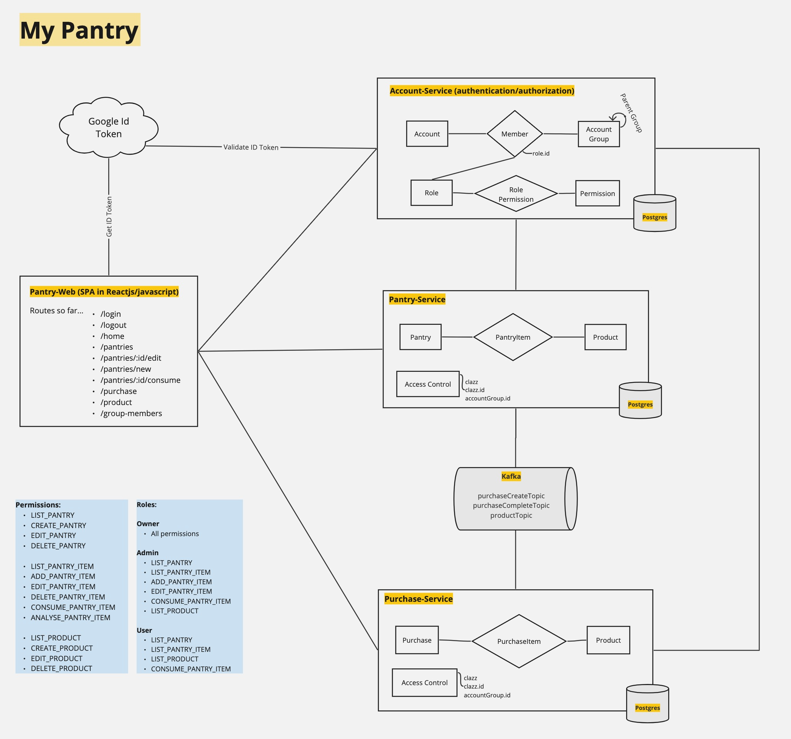

# my-pantry

It manages pantry inventories and creates shopping lists. <br/> It is all based on the consumption of the items of a
pantry.

Core functionalities available. Still under development/improvement.

Run as Docker (docker-compose file is available on the root folder): <br />
```docker compose up -d pantry-web```

### pantry-web (localhost:3000) :

| Path | Description|
|:-------------|:-------------------------|
|/| Homepage listing Pantries stored and CRUD for pantry |
|/consume| After selecting a pantry, you can consume items from it. <br /> Once the consumption of an item reaches 50%, an order to purchase is fired.
|/purchase| It lists all items (in all pantries) to be purchased. A shopping list is created once you open a new Order. When you close an Order the pantry will be updated with the purchased items.
|/product| A Products list and CRUD

### pantry-service (localhost:8080) :

- Manages pantry, pantry items and products.
- Manages the consumption of the items in the pantry as well as their replenishment
- Sends events to PurchaseCreateTopic when PantryItem reaches the defined threshold (50%)
- Listens to PurchaseCompleteTopic in order to update the pantry once the Purchase Order is closed
- Stores data in Postgres

| Request Type |  Path                    | Description          |
|:-------------|:-------------------------|:---------------------|
|GET/POST|/pantries|Pantry List & Create|
|GET/PUT/DELETE|/pantries/{pantryId}|Pantry CRUD|
|GET/POST|/pantries/{pantryId}/items|Pantry Items List & Create|
|GET/PUT/DELETE|/pantries/{pantryId}/items/{productId}| Pantry Items CRUD|
|POST|/pantries/{pantryId}/consume| Consume/Use an Item from a Pantry|
|GET|/pantries/{pantryId}/rebalance| Analyse all items in a Pantry and fire an order to purchase when item current qty <= 50% (of the ideal qty)| 

### purchase-service (localhost:8081) :

- Creates a shopping list to be purchases
- Listens to Kafka Topic (PurchaseCreateTopic) to manage a list of items to be purchased
- Produces an event and sends it to Kafka Topic (PurchaseCompleteTopic) once the purchase is closed
- Stores data in Postgres

| Request Type | Path                     | Description          |
|:-------------|:-------------------------|:---------------------|
| GET| /purchases | List Purchase Orders|
| POST| /purchases | Create an open Purchase Order|
| GET| /purchases/open | Get an existing open Purchase Order |
| POST| /purchases/close  | Close and complete a Purchase Order|
| GET| /purchases/items | List of items to be purchased, not yet associated to an open order|


