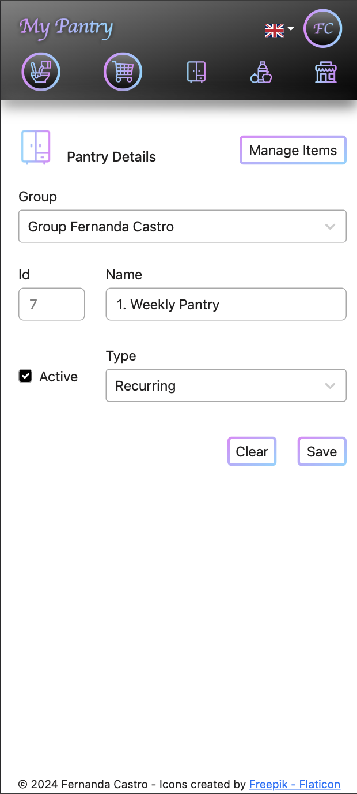
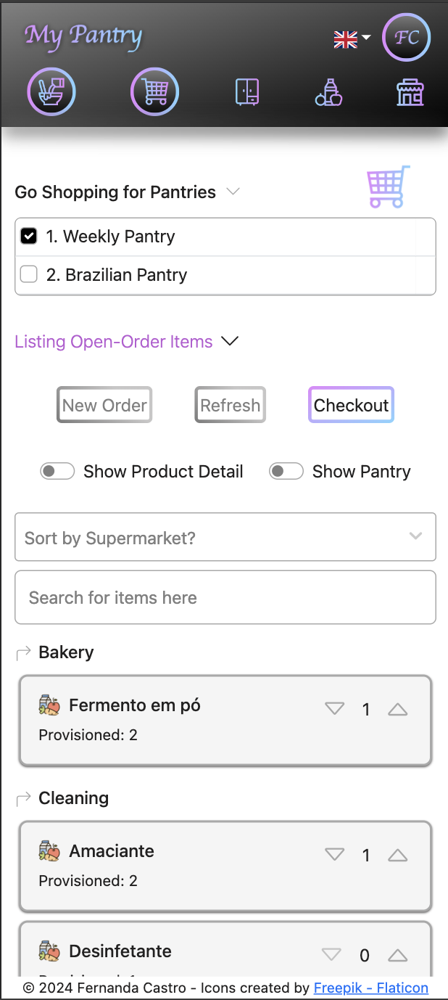

# My Pantry

<b>version: 0.11.0</b>

- pantry-web: v.0.10.0
- account-service: v0.5.0
- pantry-service: v0.7.0
- purchase-service: v0.5.0

### In this version:

- <b>pantry-web:</b>
    - Add alert to inform the use of essencial cookie
    - Remove unused libraries
    - Add "Delete Account" to the slide menu
    - Add "View items" to Account Group in Group Members page

- <b>account-service:</b>
- <b>pantry-service:</b>
- <b>purchase-service:</b>
    - Delete Account data

- <b>lib-dependencies:</b>
    - Refactoring

### In next versions:

- Delete provisioned products from the shopping list (on Shopping List page)

- CRUD for Role and Permissions

### Description:

My Pantry manages your pantries and creates shopping lists for you. Its core logic mechanism is the product
consumption. <br/>

##### Simply tell My Pantry that you opened a new package of pasta. The app will analyse the ideal and current quantities in your pantry, and in case the current quantity is below 50%, it will add Pasta to the Shopping List. <br/>

<b>RBAC</b> is managed by <i>account-service</i> and uses <b>Redis</b> as a cache support.You can also share your
Pantries, Shopping Lists and Products with other users, by adding them to your Account Group.

The Authentication is possible by either <b>Google Sign-in</b> (Google IDToken - configure it as localhost callback) or
by the traditional user/password. A <b>JWT</b> is generated and stored as a http-only cookie.

The frontend is developed in Reactjs and Javascript.

Backend is written in Java 17, based on Spring Boot and Spring Security. It uses Postgres as database, Redis as cache
for RBAC and Kafka as prov/sub for asynch communication between
pantry-service and purchase-service.

### How to run it locally:

#### Pre-steps:

1. Install **Docker** and **Maven**
2. Generate **SECURITY_SECRET** by running command: ```openssl rand -hex 64```
3. If you want to use **Google Sign-in**, then get a new Google Credentials for your MyPantry app:
    1. Log in at https://console.developers.google.com/apis
    2. Create a new project (MyPantry)
    3. Follow the instructions to configure
       it: https://developers.google.com/identity/gsi/web/guides/get-google-api-clientid

#### Steps:

1. Download the source code
2. Configure the environment variables in the docker-compose.yml:
    - SECURITY_SECRET= **<SECURITY_SECRET>**
    - GOOGLE_CLIENT_ID= **<CLIENT_ID generated by Google>**
    - GOOGLE_CLIENT_SECRET= **<CLIENT_SECRET generated by Google>**
   - ALLOWED_ORIGINS= **<SAMPLE: http://loocalhost:3000, http://localhost:8080, http://localhost:8081>**
3. Navigate to my-pantry folder
4. Run: ```mvn clean install```
5. Run: ```docker-compose up -d```

Screenshots: <br />








Themes:

| Mono Light  (default)                                                      | Mono Dark                                                                 | Lila Light                                                                 | Lila Dark                                                                 |
|:---------------------------------------------------------------------------|:--------------------------------------------------------------------------|:---------------------------------------------------------------------------|:--------------------------------------------------------------------------|
|  |  |  |  |

### pantry-web (localhost:3000) :

| Path                                                                                                                         | Description                                                                                                                                                                                                                                                                                                                                                                                                                                                     |
|:-----------------------------------------------------------------------------------------------------------------------------|:----------------------------------------------------------------------------------------------------------------------------------------------------------------------------------------------------------------------------------------------------------------------------------------------------------------------------------------------------------------------------------------------------------------------------------------------------------------|
| Home Page                                                                                                                    | When user is not logged in, show Login page link; </br> When <b><u>no Pantry exists yet</u></b>, suggests creation of first Pantry using the <b>Pantry Wizard</b>; <br/> When <b><u>at least one Pantry exists</u></b>, show <b>Pantry Dashboad</b>.                                                                                                                                                                                                            |
| Consume from Pantry <br/><br/>           | <b><u>Select the pantries</u></b>, you want to list and consume items. <br /><br/> Find the item using the search mechanism, and comsume the amount. <br/> <br/>Once <b>the consumption of an item is above 50%</b>, an event to purchase more of that item is fired. You should be able to see the in tem in the Shopping List page.                                                                                                                           
| Shopping List <br/><br/>        | <b><u>Select the pantries</u></b>, you want to list your Shopping Lists.Lists items to be purchased. <br/><br/> Open a <b>New Order</b> and choose the <b>Supermarket</b> you plan to go shopping. The items in your Shopping List will be sorted by the section categories order of the supermarket chosen. Making it easier to go shopping. <br/><br/> When you're done, click on <b>Checkout</b>, and it will update your Pantries with the purchased items. 
| Pantry Register <br/><br/>          | This is the Pantry register. It lists your pantries and its basic actions for pantries and pantry items: new, edit and delete. <br/> <br/> Here you can add or remove items to your pantry, change the ideal quantity or fix the current quantity of an item. <br/> <br/> Don't forget to click <b>Analyse Pantry</b>, so My Pantry can fix the current Shopping Lists, adding or removing items from it.                                                       |
| Product Register <br/><br/>             | This is the Product register. It lists your products and its basic actions: new, edit and delete. <br/><br/> If you plan to share products among different Account Groups (child groups), so keep the product in the highst Account Group (the parent group)                                                                                                                                                                                                    |
| Supermarket Register <br/><br/>  | This is the Supermarket register. It lists your supermarkets and its basic actions: new, edit and delete.  <br/><br/> Here you can inform the sections order of the Supermarket, and use it when going shopping.                                                                                                                                                                                                                                                |

### account-service (localhost:8082) :

- Manages Accounts, Account Groups and Account Group Members
- Manages Roles and Permissions
- Acts as **_Authentication server_**:
  - validating the _Google IDToken_ or the user/password informed
  - issuing an _JWT Token_ embedded in a _Http Only Cookie_
- Acts as **_Authorization server_**:
    - verify and retrieves permissions e/or objects associated to the user in a group

### pantry-service (localhost:8080) :

- Manages pantry, pantry items and products.
- Manages the consumption of the items in the pantry as well as their replenishment
- Sends events to purchase-service through a Kafka Topic (PurchaseCreateTopic) when PantryItem reaches the defined
  threshold (50%)
- Listens to Kafka Topic (PurchaseCompleteTopic) in order to update the Pantry Inventory once the Purchase Order is
  closed
- Stores data in Postgres

### purchase-service (localhost:8081) :

- Manages shopping lists
- Listens to Kafka Topic (PurchaseCreateTopic) to manage a list of items to be purchased
- Once the purchase is closed, an event is sent back to pantry-service through a Kafka Topic (PurchaseCompleteTopic)
- Stores data in Postgres

# Major Changelog

### [See Changelog](CHANGELOG.md)

# Credits

## Icons

- <a href="https://www.flaticon.com/free-icons/cupboard" title="cupboard icons">Cupboard icons created by Freepik -
  Flaticon</a>
- <a href="https://www.flaticon.com/free-icons/supermarket" title="supermarket icons">Supermarket icons created by
  Freepik - Flaticon</a>
- <a href="https://www.flaticon.com/free-icons/recipe" title="recipe icons">Recipe icons created by Freepik -
  Flaticon</a>
- <a href="https://www.flaticon.com/free-icons/healthy-food" title="healthy food icons">Healthy food icons created by
  Freepik - Flaticon</a>
- <a href="https://www.flaticon.com/free-icons/question" title="question icons">Question icons created by Freepik -
  Flaticon</a>
- <a href="https://www.flaticon.com/free-icons/supermarket" title="supermarket icons">Supermarket icons created by
  Freepik - Flaticon</a>


