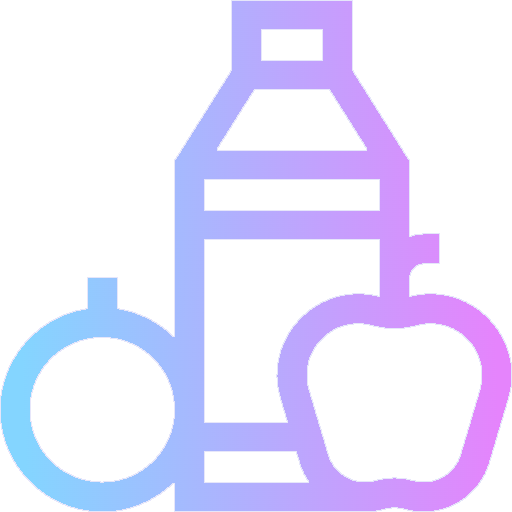
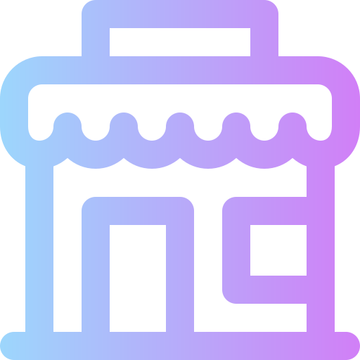
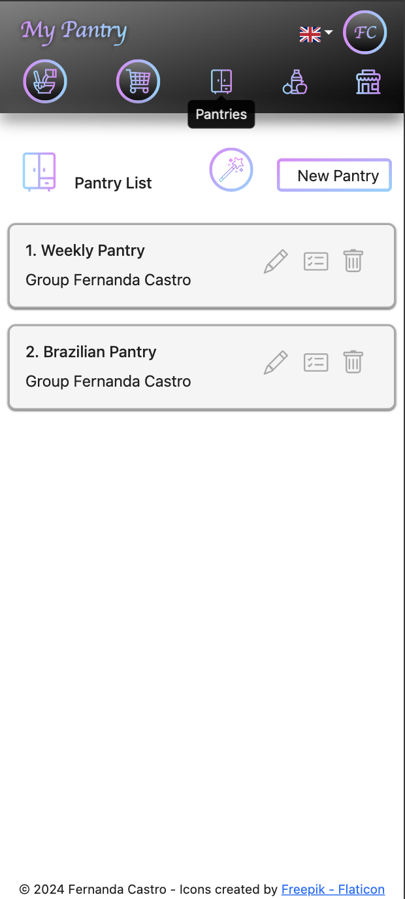
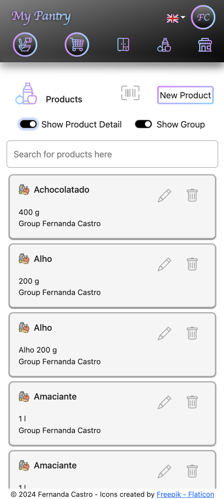
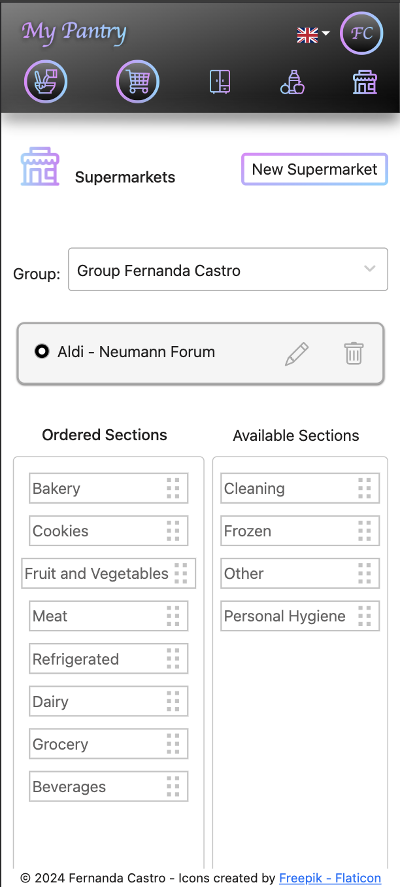
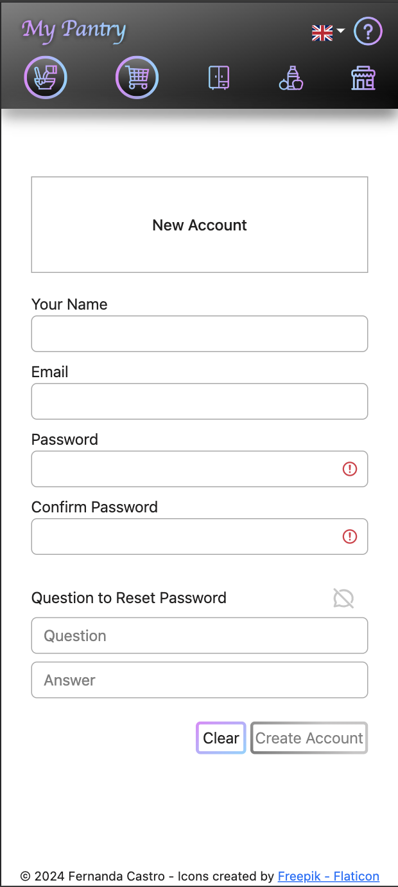
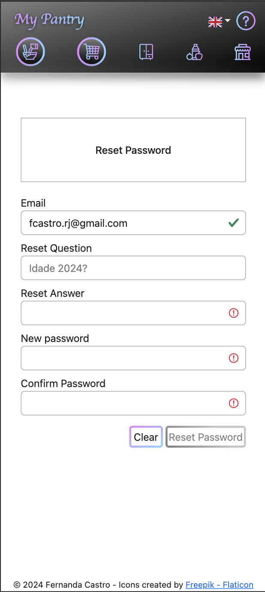
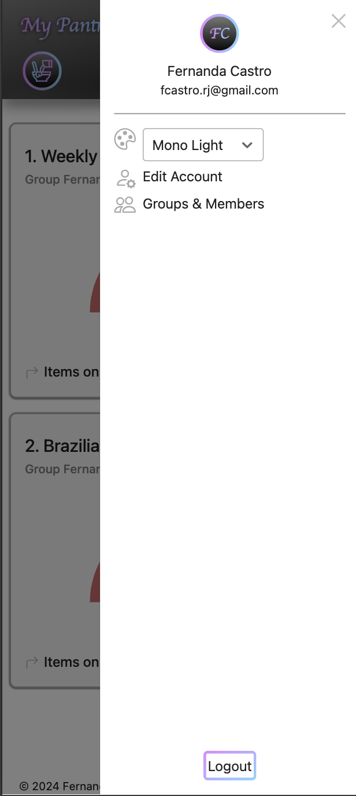

# My‑Pantry 🧺

**Home inventory and shopping list management built with a modern microservices architecture**

---

## 🚀 Overview

My‑Pantry is a full-stack web application developed as a personal project for managing pantry inventory and shopping lists. It showcases best practices using modern technologies such as microservices, JWT authentication, event-driven architecture, and Google API integration.

---

## 🔧 Tech Stack

- **Backend**: Java, Spring Boot, Spring Security (JWT), Apache Kafka, Redis Cache
- **Frontend**: ReactJS with React Query and i18n
- **Database**: PostgreSQL
- **DevOps**: Docker, GitHub Actions (CI/CD)
- **Integrations**: Google API Client, Redis, Kafka

---

## 🧠 Features

- User registration and login with **Google Sign-in** or traditional **user/password**
- 🌐 Multi-language support (currently English and Portuguese)
- Pantry inventory management
- Shopping list creation and editing
- Fast, reactive UI with React Query
- Real-time updates via Kafka
- Redis caching for optimized performance
- RBAC and ability to share Pantries, Shopping Lists and Products among users.

---

## 🗂️ Project Structure

- **pantry-web (frontend)**: responsive UI using React Query and custom styles or Bootstrap
- **account-service**: REST endpoints for authentication, authorization, RBAC and account-related api
- **pantry-service**: REST endpoints for Pantry-related api
- **purchase-service**: REST endpoints for Purchase-related api
- **commons, kafka, security and security-core:** configurations and dependencies 

---

## 🏗️ Architecture Overview

The system follows a microservices architecture, with communication via Kafka and JWT-secured REST APIs. Below is the architectural diagram:

- Microservices with Spring Boot and Spring Security
- Kafka events for decoupled, event-driven processing
- JWT as http-only cookie for authentication
- Redis for caching
- RBAC


|   Microservice    |Port| Description                                                                                                                                                                                                                                                                                                                                                                                                                   |
|:-----------------:|:--:|:------------------------------------------------------------------------------------------------------------------------------------------------------------------------------------------------------------------------------------------------------------------------------------------------------------------------------------------------------------------------------------------------------------------------------|
|  account-service  |8082| Manages Accounts, Account Groups and Account Group Members </br> Manages Roles and Permissions </br></br> Acts as **_Authentication server_**: </br> - validating the _Google IDToken_ or the user/password informed </br> - issuing an _JWT Token_ embedded in a _Http Only Cookie </br></br>Acts as **_Authorization server_**: </br> - verify and retrieves permissions e/or objects associated to the user in a group     |
|  pantry-service   |8080| Manages pantry, pantry items and products.</br> Manages the consumption of the items in the pantry as well as their replenishment</br>Sends events to purchase-service through a Kafka Topic (PurchaseCreateTopic) when PantryItem reaches the defined threshold (50%)</br>Listens to Kafka Topic (PurchaseCompleteTopic) in order to update the Pantry Inventory once the Purchase Order isclosed</br>Stores data in Postgres 
| purchase-service  |8081| Manages shopping lists</br>Listens to Kafka Topic (PurchaseCreateTopic) to manage a list of items to be purchased</br>Once the purchase is closed, an event is sent back to pantry-service through a Kafka Topic (PurchaseCompleteTopic)</br>Stores data in Postgres                                                                                                                                                          |


---

## ⚙️ Running Locally

### Prerequisites

- Docker & Docker Compose installed


- If you want to use **Google Sign-in**, then get a new Google Credentials for your MyPantry app:
    1. Log in at https://console.developers.google.com/apis
    2. Create a new project (MyPantry)
    3. Follow the instructions to configure
       it: https://developers.google.com/identity/gsi/web/guides/get-google-api-clientid


- Configure the environment variables in the docker-compose.yml:
    - SECURITY_SECRET= ```openssl rand -hex 64```
    - ALLOWED_ORIGINS= *http://localhost:3000, http://localhost:8080, http://localhost:8081*
    - GOOGLE_CLIENT_ID= *generated by Google*
    - GOOGLE_CLIENT_SECRET= *generated by Google*


### Steps

```bash
git clone https://github.com/FernandaCastro/my-pantry.git
cd my-pantry
mvn clean install
docker compose up --build
```

Once up and running:
- Frontend: http://localhost:3000
- Pantry API: http://localhost:8080/pantryservice
- Purchase API: http://localhost:8081/purchaseservice
- Account API: http://localhost:8082/accountservice

---

## 🧪 Testing & CI/CD
GitHub Actions for CI/CD: build, test, deploy

Unit and integration testing: JUnit & Mockito (backend)

---

## 🖼️ User Interface

##  🎯 UI Icons & Actions

Here’s a quick guide to the main icons used in the UI:

|                                                             Icon                                                             | Description                                                                                                                                                                                                                                                                                                                                                                                                                                                                                 |
|:----------------------------------------------------------------------------------------------------------------------------:|:--------------------------------------------------------------------------------------------------------------------------------------------------------------------------------------------------------------------------------------------------------------------------------------------------------------------------------------------------------------------------------------------------------------------------------------------------------------------------------------------|
|                                                          Home Page                                                           | **Home** When user is not logged in, show Login page link; </br> When <b><u>no Pantry exists yet</u></b>, suggests creation of first Pantry using the <b>Pantry Wizard</b>; <br/> When <b><u>at least one Pantry exists</u></b>, show <b>Pantry Dashboad</b>.                                                                                                                                                                                                                               |
|                                          | **Consume from Pantry** <br/><br/> <b><u>Select the pantries</u></b>, you want to list and consume items. <br /><br/> Find the item using the search mechanism, and comsume the amount. <br/> <br/>Once <b>the consumption of an item is above 50%</b>, an event to purchase more of that item is fired. You should be able to see the in tem in the Shopping List page.                                                                                                                    
|                                 | **Shopping List** <br/><br/><b><u>Select the pantries</u></b>, you want to list your Shopping Lists.Lists items to be purchased. <br/><br/> Open a <b>New Order</b> and choose the <b>Supermarket</b> you plan to go shopping. The items in your Shopping List will be sorted by the section categories order of the supermarket chosen. Making it easier to go shopping. <br/><br/> When you're done, click on <b>Checkout</b>, and it will update your Pantries with the purchased items. 
|                                     | **Pantry Register** <br/><br/> This is the Pantry register. It lists your pantries and its basic actions for pantries and pantry items: new, edit and delete. <br/> <br/> Here you can add or remove items to your pantry, change the ideal quantity or fix the current quantity of an item. <br/> <br/> Don't forget to click <b>Analyse Pantry</b>, so My Pantry can fix the current Shopping Lists, adding or removing items from it.                                                    |
|                                         | **Product Register** <br/><br/> This is the Product register. It lists your products and its basic actions: new, edit and delete. <br/><br/> If you plan to share products among different Account Groups (child groups), so keep the product in the highst Account Group (the parent group)                                                                                                                                                                                                |
|                                  | **Supermarket Register** <br/><br/>This is the Supermarket register. It lists your supermarkets and its basic actions: new, edit and delete.  <br/><br/> Here you can inform the sections order of the Supermarket, and use it when going shopping.                                                                                                                                                                                                                                         |


## 📸 Screenshots

Here’s how the main interface looks, with icons for:












## 🎨 Themes

| Mono Light  (default)                                                      | Mono Dark                                                                 | Lila Light                                                                 | Lila Dark                                                                 |
|:---------------------------------------------------------------------------|:--------------------------------------------------------------------------|:---------------------------------------------------------------------------|:--------------------------------------------------------------------------|
|  |  |  |  |

---

## 🛣️ Roadmap

<b>version: 0.11.0</b>

- pantry-web: v.0.10.0
- account-service: v0.5.0
- pantry-service: v0.7.0
- purchase-service: v0.5.0

### In this version:

- **pantry-web:** 
    - [x] Add alert to inform the use of essencial cookie
    - [x] Remove unused libraries
    - [x] Add "Delete Account" to the slide menu
    - [x] Add "View items" to Account Group in Group Members page

- **purchase-service:**
  - [x] Delete Account data
        
- <b>lib-dependencies:</b>
  - [x] refactoring

### In next versions:

- [ ] Delete provisioned products from the shopping list (on Shopping List page)
- [ ] CRUD for Role and Permissions


# Major Changelog

### [See Changelog](CHANGELOG.md)


---

## 📌 About This Project
This project demonstrates modern backend/frontend development using:

- Microservices and event-driven architecture

- Secure backend with Spring Security + JWT in Http only cookie

- Modern frontend with React and state management via React Query

- Containerized architecture with Docker for reproducibility

- Integration of third-party services (Google API, Kafka, Redis)

---

## 🤝 Contributions & Contact
Contributions are welcome! Feel free to open an Issue or Pull Request.
Contact: @FernandaCastro on GitHub

---

## 📜 License
This project is licensed under the MIT License.


---
## Credits

### Icons

- <a href="https://www.flaticon.com/free-icons/cupboard" title="cupboard icons">Cupboard icons created by Freepik -
  Flaticon</a>
- <a href="https://www.flaticon.com/free-icons/supermarket" title="supermarket icons">Supermarket icons created by
  Freepik - Flaticon</a>
- <a href="https://www.flaticon.com/free-icons/recipe" title="recipe icons">Recipe icons created by Freepik -
  Flaticon</a>
- <a href="https://www.flaticon.com/free-icons/healthy-food" title="healthy food icons">Healthy food icons created by
  Freepik - Flaticon</a>
- <a href="https://www.flaticon.com/free-icons/question" title="question icons">Question icons created by Freepik -
  Flaticon</a>
- <a href="https://www.flaticon.com/free-icons/supermarket" title="supermarket icons">Supermarket icons created by
  Freepik - Flaticon</a>
