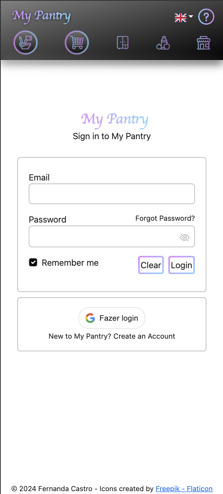
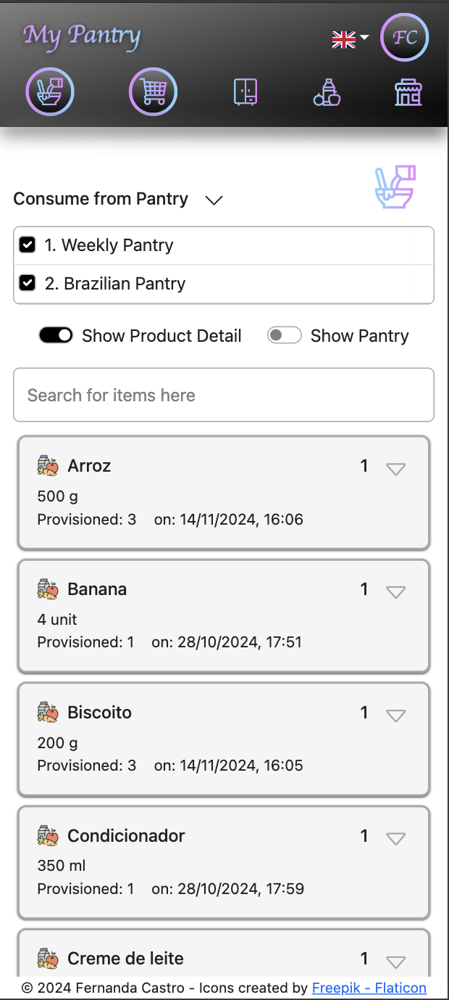

# My Pantry

version: 0.1.0

- Internationalization (EN-PT)
- CRUD for Supermarkets and its particular order of categories
- New Permissions: list_supermarket, create_supermarket, edit_supermarket and delete_supermarket
- Add permissions to ROLE ADMIN: It has all ROLE OWNER permissions, except the delete permissions.
- All Roles and its associated Permissions are listed on the Group & Members page.

Plans for next versions:

- Delete provisioned products from the shopping cart
- Wizard to create pantries based on a suggested list of basic items, instead of manually enter them.
- CRUD for Role and Permissions

### Description:

My Pantry manages pantries and automatically creates shopping lists as products are consumed from the
inventory. <br/> <br/>
You can also share your Pantries, Shopping Lists and Products with other users, by adding users to your Account Group.

The Authentication is possible by either Google Sign-in (Google IDToken - having localhost as callback) or by the
traditional user/password.

The frontend is developed in Reactjs and Javascript, while backend is written in Java 17, Spring Boot and Spring
Security.

### How to run it locally:

#### Pre-steps:

1. Install **Docker** and **Maven**
2. Generate **SECURITY_SECRET** by running command: ```openssl rand -hex 64```
3. If you want to use **Google Sign-in**, then get new Google Credentials for MyPantry app:
    1. Log in at https://console.developers.google.com/apis
    2. Create a new project (MyPantry)
    3. Follow the instructions to configure
       it: https://developers.google.com/identity/gsi/web/guides/get-google-api-clientid

#### Steps:

1. Download the source code
2. Configure the environment variables in the docker-compose.yml:
    - SECURITY_SECRET= **<SECURITY_SECRET>**
    - GOOGLE_CLIENT_ID= **<CLIENT_ID generated by Google>**
    - GOOGLE_CLIENT_SECRET= **<CLIENT_SECRET generated by Google>**
   - ALLOWED_ORIGINS= **<SAMPLE: http://loocalhost:3000, http://localhost:8080, http://localhost:8081>**
3. Navigate to my-pantry folder
4. Run: ```mvn clean install```
5. Run: ```docker-compose up -d```

Screenshots: <br />






### pantry-web (localhost:3000) :

| Path | Description|
|:-------------|:-------------------------|
|/pantries<br/> | List Pantries and its related actions: new, edit and delete |
|/consume<br/>  | <b><u>After selecting a pantry</u></b>, you can consume items from it. <br /> Once the consumption of an item reaches 50%, an event to purchase more of that item is fired.
|/purchase<br/> | Lists items to be purchased. <br/> Items can be sorted by your favorite Supermarket category order. <br/> A shopping list is created <b>once you open a new Order</b>. <br/> When you're done with shopping and <b>close the Order</b>, then it updates your Pantry Inventory with the purchased items.
|/product<br/> | List Products and its related actions: new, edit and delete

### account-service (localhost:8082) :

- Manages Accounts, Account Groups and Account Group Members
- Manages Roles and Permissions
- Acts as **_Authentication server_**:
  - validating the _Google IDToken_ or the user/password informed
  - issuing an _JWT Token_ embedded in a _Http Only Cookie_
- Acts as **_Authorization server_**:
  - retrieving the permissions associated to the user in a group

### pantry-service (localhost:8080) :

- Manages pantry, pantry items and products.
- Manages the consumption of the items in the pantry as well as their replenishment
- Sends events to purchase-service through a Kafka Topic (PurchaseCreateTopic) when PantryItem reaches the defined
  threshold (50%)
- Listens to Kafka Topic (PurchaseCompleteTopic) in order to update the Pantry Inventory once the Purchase Order is
  closed
- Stores data in Postgres

### purchase-service (localhost:8081) :

- Manages shopping lists
- Listens to Kafka Topic (PurchaseCreateTopic) to manage a list of items to be purchased
- Once the purchase is closed, an event is sent back to pantry-service through a Kafka Topic (PurchaseCompleteTopic)
- Stores data in Postgres


